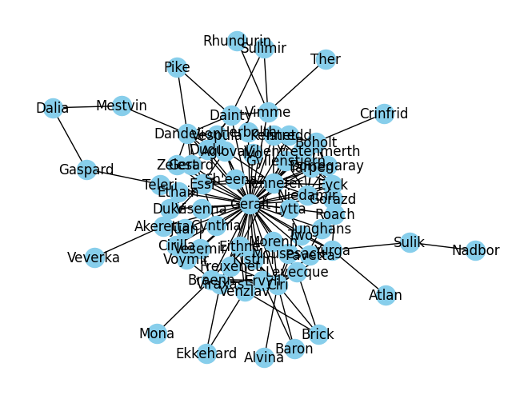
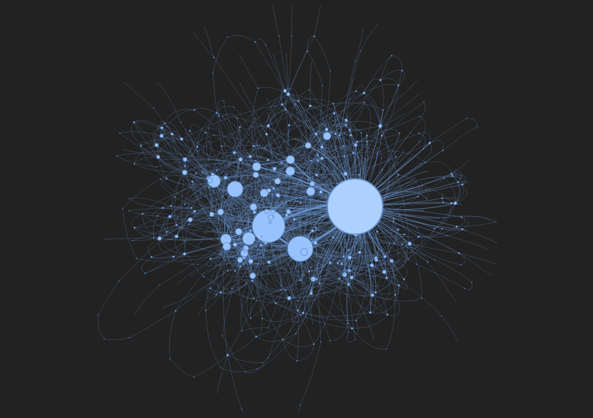
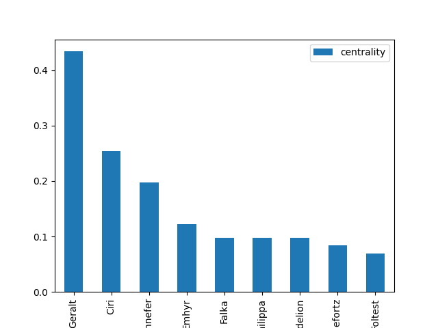
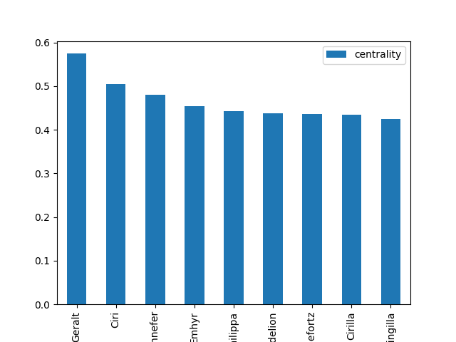
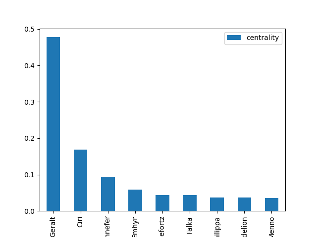
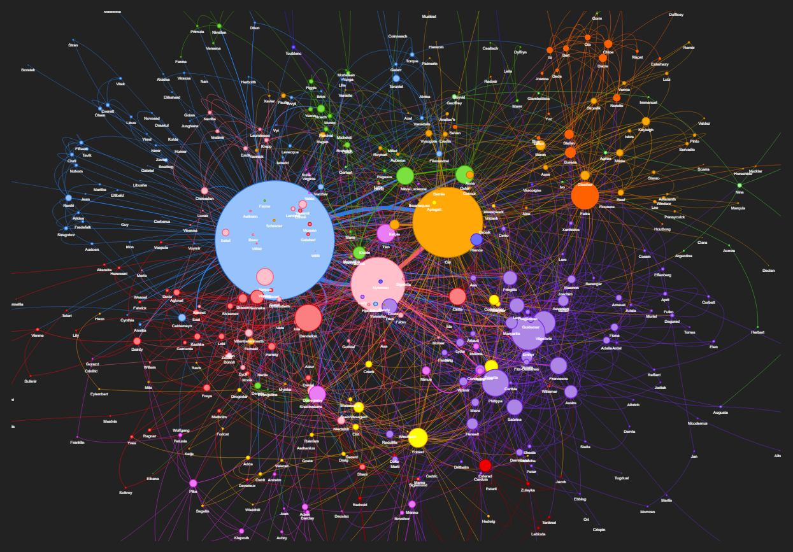
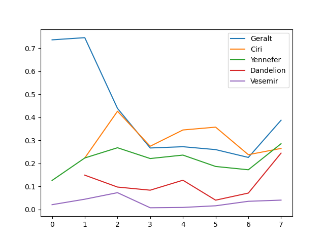

# The Witcher: Character Network
```The project focuses on discovering the interconnectedness of all the mentioned characters mentioned in all the Witcher books, and thus finding and analyzing the magnitude of the importance of each characters based on the importance of each character relationship by total number of connections with that character and total number of connections with all other characters as a whole. ```

# Main Objectives
### 1. To find the most important characters
### 2. How Character importance evolves over time?
### 3. What are different communities or clusters formed in the network

# Motivations

# Future Scope

# Features

# Prerequisites
### 1. Spacy (alternative NLTK)
```
    cmd>> pip3 install spacy
    use>> Text processing and name entity recognition, NLP package
```
### 2. NetworkX
```
    cmd>> pip3 install networkx
    use>> For analysing the network
```
### 3. pyvis
```
    cmd>> pip3 install pyvis
    use>> Network graph visualization
```

### 4. Web Scraping
#### Selenium: A browser automation library, and not a web scraping library, although it can be used for scrapping. It can be used to automate tasks as humans on websites like opening a browser, moving mouse, or clicking buttons. Selenium is great for scraping dynamic web pages that use js to serve contents, eg. dropdown list, etc., selenium can interact with all this components and grab the data out. Limitations of selenium: Can not handle huge data size like scrapy. 

#### Beautiful Soup: BeautifulSoup is just a parsing library, that can be used to parse html contents, and can also be used for scraping along with requests.

#### Scrapy: Scrapy is a proper web scraping framework, and can handle huge data sizes. Scrapy along with selenium can be used to scrap entire dynamic websites.

### 5. Model: Named Entity Recognition
```
    cmd>> python3 -m spacy download en_core_web_sm
    use>> English Language Model (To detect names)
```

### 6. Centralities

### 7. Louvain
```
    cmd>>  pip3 install python_louvain
    use>> Community Detection Algorithm
```

# Concepts Touched
### 1. Scraping data
### 2. Creating Network
#### 2.1 Network Graph by NetworkX (Kamada Kawai Layout)

#### 2.2 Network Graph by pyvis

[Click here]("graph/witcher_network.html")
### 3. Centralities
#### 3.1. Highest Degrees centrality

#### 3.2. Best Closeness 

#### 3.3. Highest Between-ness Centrality

#### 3.4. Highest Eigenvector Centrality
### 4. Community Detection on a network

[Click here]("graph/witcher_communities.html")
### 5. Evolution of character by Degree centrality



# Stratergy
#### 1. Tokenized every book into a list of sentences
#### 2. Label each sentence by the name of characters appearing in sentences
#### 3. Define a window size of how far two sentences are part from each other and assume if two characters are mentioned together in two sentences within this window then there is a relationship between them
#### 4. With Name Entity Recognition we'll recognize all types of entity from texts, from person names to organizations name to locations
#### 5. To filter out only the character names, scrap the fandom site to get all the character names
#### 6. To scrap all the character names from all the books


## Steps 
### Step-0 : Scrap fandom site for character names 
```
{
    "url": "https://www.witcher.fandom.com/wiki/World"
}
```
#### Step-0.1 : Use Selenium with requests to scrap
#### Step-0.2 : Get website data
#### Step-0.3 : Parse the data and restructure it in dataframe

### Step-1 : Import English language model for spacy
```
{
    "model": "en_core_web_sm"
}
```

### Step 2 : Download all the books in text file format
```
{
    "link": "https://github.com/dworschak/Witcher/tree/master/RESSOURCES/_books/text"
}
```


# Commands to setup the project from scratch
```
### For Web Scraping 
cmd>> python3.11 -m pip install --upgrade pip
cmd>> python3.11 -m venv venv
cmd>> source venv/bin/activate
cmd>> pip3 install pandas selenium jupyterlab webdriver-manager
cmd>> pip3 install matplotlib

### For Network Analysis
cmd>> pip3 install numpy
cmd>> pip3 install spacy
cmd>> pip3 install networkx
cmd>> python3 -m spacy download en_core_web_sm
cmd>> pip3 install scipy
cmd>> pip3 install pyvis

### For Community detection
cmd>>  pip3 install python_louvain


cmd>> dmesg --> On a Linux system, check the output of dmesg. If the process is getting killed by the kernel, it will have a explanation there. Most probable reason: out of memory, or out of file descriptors.

cmd>> pip install glob2


```

